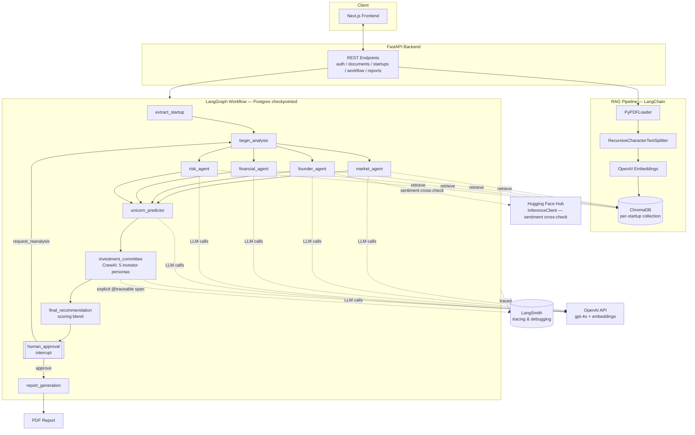

# SharkIQ — Design

AI Venture Capital Intelligence Platform: upload a startup's pitch deck and
supporting documents, and a multi-agent system runs due diligence, simulates
an investor committee vote, and produces a scored investment recommendation
with a human approval gate and a downloadable PDF report.

## 1. Personas

| Persona | Goal | Key flows |
|---|---|---|
| **VC Associate** | Screen many startups quickly with consistent, documented analysis | Upload docs → start analysis → review per-agent breakdown → approve/reject |
| **Investment Partner** | Make the final call with auditable reasoning, not a black box | Final recommendation card → committee votes → human approval gate (approve / reject / request re-analysis) |
| **Startup Founder** (indirect) | Submits a pitch deck for evaluation | Upload page → tracked via startup detail page |
| **Platform Engineer / ML Eng** | Debug agent behavior, prompts, and retrieval quality | LangSmith traces per run, structured JSON logs, LangGraph checkpoints |

## 2. Use cases

1. Upload a pitch deck / business plan (PDF) → chunked, embedded, indexed into a per-startup Chroma collection.
2. Extract structured startup facts (name, industry, problem, solution, revenue model, funding ask) from the indexed documents.
3. Run four parallel due-diligence agents (market, founder, financial, risk), each grounded in retrieved document chunks (RAG).
4. Run a "unicorn predictor" agent that synthesizes the four analyses into survival/Series-A/unicorn probabilities.
5. Run a simulated investment committee (5 investor personas via CrewAI) that each independently vote INVEST/PASS with a suggested check size.
6. Blend agent scores + committee vote ratio into a single overall score and decision (Strong Invest / Invest with Caution / Monitor / Reject).
7. Pause for **human-in-the-loop approval** (LangGraph `interrupt`) before generating the final report; a human can approve, reject, or request re-analysis (loops back into the four agents, e.g. after uploading more documents).
8. Generate a downloadable PDF investment report.
9. (New) Cross-check founder communication sentiment using an open-source Hugging Face Hub model, independent of the OpenAI-based agents.
10. (New) Every chain/agent/graph run is traced in LangSmith for debugging prompts, retrieval quality, and latency.

## 3. Tech stack

| Layer | Choice | Why |
|---|---|---|
| Orchestration | **LangGraph** | Stateful graph with fan-out/fan-in parallel agents, durable Postgres checkpointing, native human-in-the-loop `interrupt`/`Command(resume=...)` |
| Agent framework | **LangChain** (`langchain-openai`, structured output) | Per-agent RAG chains (`prompt \| llm.with_structured_output(schema)`), retry policy, single place to swap models |
| Multi-agent committee | **CrewAI** | Independent persona-based agents (financial/market/risk/growth/technology investors) voting sequentially, decoupled from the LangGraph state machine |
| Vector store | **ChromaDB** (via `langchain-chroma`) | Per-startup collection, MMR retrieval for diverse, non-redundant chunks |
| Primary LLM | **OpenAI API** (`gpt-4o`, `text-embedding-3-small`) | Structured-output reliability for the extraction/analysis schemas |
| Secondary model provider | **Hugging Face Hub** (`huggingface_hub.InferenceClient`, `distilbert-base-uncased-finetuned-sst-2-english`) | Independent, open-source cross-check signal (founder communication sentiment) sourced from a different provider than OpenAI |
| Observability | **LangSmith** | Tracing for every LangChain/LangGraph call plus explicit `@traceable` spans around the CrewAI committee (which otherwise wouldn't appear, since CrewAI calls go through litellm, not the LangChain client) |
| API | FastAPI + SQLAlchemy (async) + Alembic | Workflow/document/startup endpoints, Postgres-backed checkpointer |
| Frontend | Next.js (App Router) + Tailwind | Upload, dashboard, startup detail with per-agent tabs, approval UI |
| Reporting | ReportLab | PDF investment report generation |

## 4. System architecture

## 5. Workflow mapping back to the assignment

- **Design**: personas/use cases/tech stack above; diagram shows every required component (LangChain, LangGraph, CrewAI, ChromaDB, LangSmith, OpenAI, Hugging Face Hub) and how they connect.
- **Build**: RAG (`app/rag/*`) + agents (`app/agents/*`, `app/committee/*`) + LangGraph orchestration (`app/workflows/*`) + monitoring (LangSmith tracing via `app/core/tracing.py`, structured `structlog` logs, `X-Request-ID` middleware).
- **Version control**: see repo root `.gitignore` and initial commit; push to a GitHub remote to complete this step.
