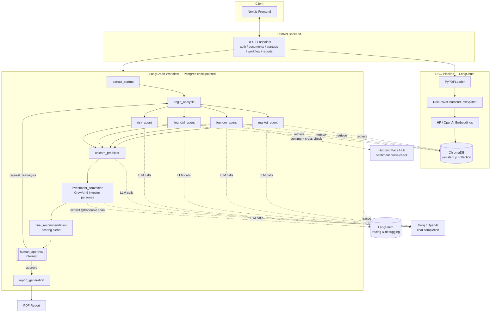

# SharkIQ

🌐 Live Demo: https://shark-iq.vercel.app/

**AI Venture Capital Intelligence Platform** — upload a startup's pitch deck and supporting documents, and a multi-agent system runs due diligence, simulates an investor committee vote, and produces a scored investment recommendation with a human approval gate and a downloadable PDF report.

## What it does

1. Upload a pitch deck / business plan (PDF) → chunked, embedded, and indexed into a per-startup ChromaDB collection.
2. Extract structured startup facts (name, industry, problem, solution, revenue model, funding ask) from the indexed documents.
3. Run four parallel due-diligence agents — **Market**, **Founder**, **Financial**, **Risk** — each grounded in retrieved document chunks (RAG).
4. Synthesize the four analyses into survival / Series-A / unicorn probabilities.
5. Simulate an investment committee (5 investor personas via CrewAI) that each independently vote INVEST/PASS with a suggested check size.
6. Blend agent scores + committee vote ratio into a single overall score and decision (Strong Invest / Invest with Caution / Monitor / Reject).
7. Pause for **human-in-the-loop approval** (LangGraph `interrupt`) before generating the final report — a human can approve, reject, or request re-analysis (loops back into the four agents, e.g. after uploading more documents).
8. Generate a downloadable PDF investment report.
9. Cross-check founder communication sentiment using an open-source Hugging Face model, independent of the primary LLM provider.
10. Trace every chain/agent/graph run in LangSmith for debugging prompts, retrieval quality, and latency.

## Tech stack

| Layer | Choice |
|---|---|
| Orchestration | **LangGraph** — stateful graph with fan-out/fan-in parallel agents, Postgres checkpointing, native human-in-the-loop `interrupt`/`Command(resume=...)` |
| Agent framework | **LangChain** — per-agent RAG chains (`prompt \| llm.with_structured_output(schema)`), retry policy |
| Multi-agent committee | **CrewAI** — independent persona-based agents (financial/market/risk/growth/technology investors) voting sequentially |
| Vector store | **ChromaDB** (via `langchain-chroma`) — per-startup collection, MMR retrieval for diverse, non-redundant chunks |
| Chat LLM | **Groq** (`llama-3.1-8b-instant` by default) — fast, low-cost structured-output inference; OpenAI (`gpt-4o`) kept as a drop-in alternative |
| Embeddings | **Hugging Face `sentence-transformers`** (local, CPU, no API key) for RAG; OpenAI embeddings available as an alternative |
| Secondary signal | **Hugging Face Hub** `InferenceClient` (`distilbert-base-uncased-finetuned-sst-2-english`) — independent founder-communication sentiment cross-check |
| Observability | **LangSmith** — tracing for every LangChain/LangGraph call plus explicit spans around the CrewAI committee |
| API | **FastAPI** + SQLAlchemy (async) + Alembic, Postgres-backed LangGraph checkpointer |
| Frontend | **Next.js** (App Router) + Tailwind CSS |
| Reporting | **ReportLab** — PDF investment report generation |

## Architecture



See [DESIGN.md](DESIGN.md) for personas, use cases, and the full design writeup.

## Project structure

```
backend/
  app/
    agents/        # Market, Founder, Financial, Risk, Committee, Extraction agents
    api/v1/         # FastAPI routers (auth, documents, startups, workflow, health, ...)
    core/           # config, security, logging, tracing, rate limiting
    rag/            # document loading, chunking, embeddings
    schemas/        # Pydantic request/response & analysis schemas
    services/       # document & workflow orchestration services
    workflows/      # LangGraph graph, nodes, state, checkpointer
  alembic/          # DB migrations
  tests/            # unit + integration tests
frontend/
  app/              # Next.js App Router pages (dashboard, upload, startup detail, auth)
  components/       # shared UI components
  lib/              # API client, utilities
```

## Getting started

### Prerequisites

- Python 3.11+
- Node.js 20+
- PostgreSQL 14+

### Backend

```bash
cd backend
python -m venv .venv
source .venv/bin/activate   # Windows: .venv\Scripts\activate
pip install -r requirements.txt

cp .env.example .env        # fill in DATABASE_URL, GROQ_API_KEY, LANGCHAIN_API_KEY, etc.

alembic upgrade head
python run_dev.py           # or: uvicorn app.main:app --reload
```

### Frontend

```bash
cd frontend
npm install
npm run dev                 # http://localhost:3010
```

### Tests

```bash
cd backend
pytest
```

## Environment variables

See [backend/.env.example](backend/.env.example) for the full list — database connection, Groq/OpenAI keys, Hugging Face token, LangSmith tracing, storage paths, and JWT settings.
